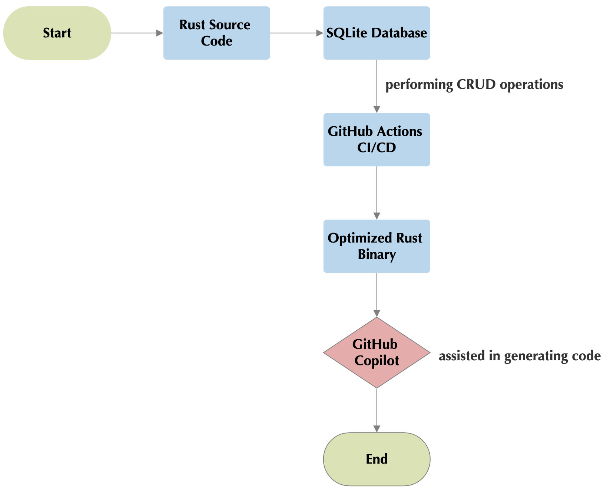
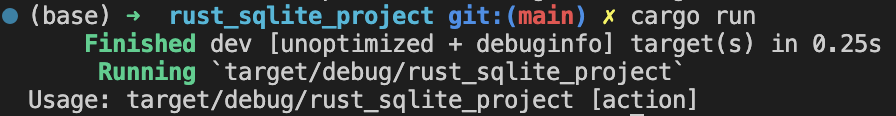
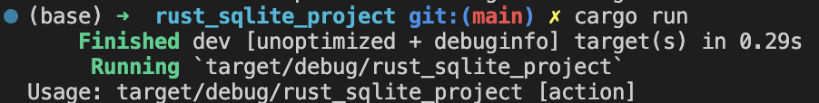
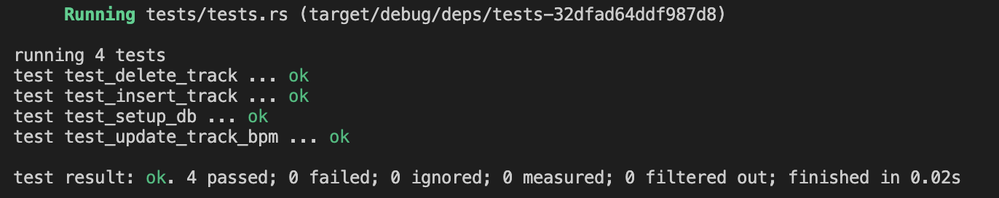

[](https://github.com/nogibjj/Jiechen_Li_Individual_2/actions/workflows/cicd.yml)

# Jiechen_Li_Individual_2

## Purpose

This project uses Rust Script interacting with SQL Database, SQLite. It utilizes continuous integration using GitHub Actions to automatically set up environment, test, format and lint code. It also uses an AI Assistant--GitHub Copilot to assit the process.

The ``spotify_2023_1.csv`` is from: <https://www.kaggle.com/datasets/nelgiriyewithana/top-spotify-songs-2023/code>

This dataset contains a comprehensive list of the most famous songs of 2023 as listed on Spotify. The dataset offers a wealth of features beyond what is typically available in similar datasets. It provides insights into each song's attributes, popularity, and presence on various music platforms. The dataset includes information such as track name, artist(s) name, release date, Spotify playlists and charts, streaming statistics, Apple Music presence, Deezer presence, Shazam charts, and various audio features.


## Process Visualization



## Build Rust Environment

1. Use ``rustup`` to install Rust

```bash
curl --proto '=https' --tlsv1.2 -sSf https://sh.rustup.rs | sh
```

2. Restart the shell and run

```bash
source $HOME/.cargo/env
```

3. Create a Rust project

```bash
cargo new rust_sqlite_project  # rust_sqlite_project is my project name
```

## Add SQLite Dependency

1. Use ``rusqlite`` crate in Rust

```toml
[dependencies]
rusqlite = "0.29.0"    # check for the latest version on crates.io
```

2. Then build it

```bash
cargo build
```

## Troubleshooting

Rust tests run in parallel by default. This is efficient, but it can cause interference between tests, especially when they're operating on shared resources, like a file. When I run the test simultaneously I always got the error message suggests that the table does not exist.

```bash
cargo clean
cargo test
```

With the help of GitHub Copilot, then I tried to use the command-line option``--test-threads=1``. This will help to confirm if interference between tests is the problem. The tests passed when run in series, it confirms that there's interference when they run in parallel.

```bash
cargo test -- --test-threads=1
```

## Results

**main.rs result**:<br/>
  

**lib.rs result**: <br/>
  

**tests.rs result**: <br/>
  

## Demo Video

Please click <a href="https://youtu.be/fIlqYSDHRA8" target="_blank">here</a> to watch the explanatory Demo Video of this repo.

## References

* [Rust-Cli-Template](https://github.com/kbknapp/rust-cli-template)
* Check for the latest Rust [dependency](https://crates.io/search?q=main)
